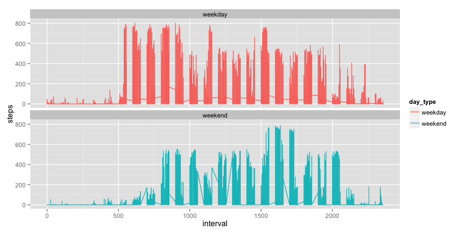

# Reproducible Research: Peer Assessment 1
This is my work for the class [Reproducible Research](https://www.coursera.org/course/repdata).

## Loading and preprocessing the data

The code below sets the working directory, unzips the file and reads it in.  If you run this code on your own system, please change the working directory to the location where your activity.zip and/or activity.csv file is stored.


```r
# Set this to the location of this file before running.
setwd("~/dsrrpa1")
if(!file.exists('activity.csv')){
    unzip('activity.zip')
}
# Read it in
activity <- read.csv("activity.csv")
```

## What is mean total number of steps taken per day?

In order to determine how may steps per day were taken, we first aggregate the data by steps and date.


```r
steps_per_day <- aggregate(steps ~ date, data=activity, sum, na.rm=TRUE, na.action=NULL)
```

With that we can determine the mean and median values of steps per day:


```r
mean(steps_per_day$steps)
```

```
## [1] 9354
```

```r
median(steps_per_day$steps)
```

```
## [1] 10395
```

We can also view the steps per day as a histogram:


```r
hist(steps_per_day$steps, main="Steps Per Day", xlab="Steps")
```

 

## What is the average daily activity pattern?

In order to answer the question, what is the average daily activity pattern, we start by aggregating the data by interval producing the mean of steps for each interval.


```r
steps_per_interval <- aggregate(steps ~ interval, data=activity, mean, na.rm=TRUE, na.action=NULL)
# Create row names to ease using this later.
row.names(steps_per_interval) <- steps_per_interval$interval
```

The results of this show that for the most part, the people in this study performed most of their walking during daylight hours and start their activity shortly after 5AM.


```r
plot(steps_per_interval, type = "l", xlab="Interval", ylab="Steps", main="Average Steps Per Interval")
```

 

The graph shows one time interval that has much more activity than the rest, so it might be interesting to single out that data:


```r
# Calculate the max steps that take place in any interval
max(steps_per_interval$steps)
```

```
## [1] 206.2
```

```r
# Which interval had that value?
steps_per_interval$interval[which.max(steps_per_interval$steps)]
```

```
## [1] 835
```

And with that we find that the most active period of time is 08:35, with a mean of 206.2 steps taken during that interval.

## Imputing missing values

Note that there are a number of days/intervals in the source data where there are missing
values (coded as `NA`). The presence of missing days may introduce
bias into some calculations or summaries of the data.

How many observations are missing a value for steps?


```r
# Find observations that contain NA for steps
steps_na <- is.na(activity$steps)
# Number of cases where steps is NA
sum(steps_na)
```

```
## [1] 2304
```

### Strategy for imputing missing data

In order to fill in the data, we can simply fill in each missing steps value for each interval, with the mean of each interval we created above (steps_per_interval).  We will do this using a new data frame called activity_filled.


```r
# Make a copy of activity
activity_filled <- activity
# Replace NA values with values from steps_per_interval
activity_filled[steps_na,]$steps <- steps_per_interval[
  as.character(activity_filled[steps_na,]$interval),]$steps 
```

Next we can determine how may steps per day were taken by aggregating the data by steps and date.


```r
steps_per_day_filled <- aggregate(steps ~ date, data=activity_filled, sum, na.rm=TRUE, na.action=NULL) 
```

We can then use this aggregation to calculate the mean and median values and compare these values to those we calucated off the base data:


```r
mean(steps_per_day_filled$steps) 
```

```
## [1] 10766
```

```r
median(steps_per_day_filled$steps) 
```

```
## [1] 10766
```
The mean and median are the same this time.

We can also view the steps per day for our filled data as a histogram:


```r
hist(steps_per_day_filled$steps, main="Steps Per Day", xlab="Steps")
```

 

## Are there differences in activity patterns between weekdays and weekends?

In order to answer this question we start by creating a new factor variable in the dataset with two levels -- "weekday" and "weekend" indicating whether a given date is a weekday or weekend day.


```r
# First create the column, and set the default to "weekday" since that will be the majority
activity_filled$day_type <- "weekday"
# Then replace the value for weekend days
activity_filled[weekdays(strptime(activity_filled$date, '%Y-%m-%d'), TRUE) %in% c("Sat", "Sun"), ]$day_type <- "weekend"
```

We then plot the data to show the difference in activity between weekends and weekdays:


```r
library(ggplot2)
ggplot(data=activity_filled, aes(x=interval, y=steps, group=day_type)) +
  geom_line(aes(color=day_type)) + 
  facet_wrap(~ day_type, nrow=2)
```

 

From this we can see that on the weekends, people start their activity much later than they do on the week days and end their activity a little earier too.

